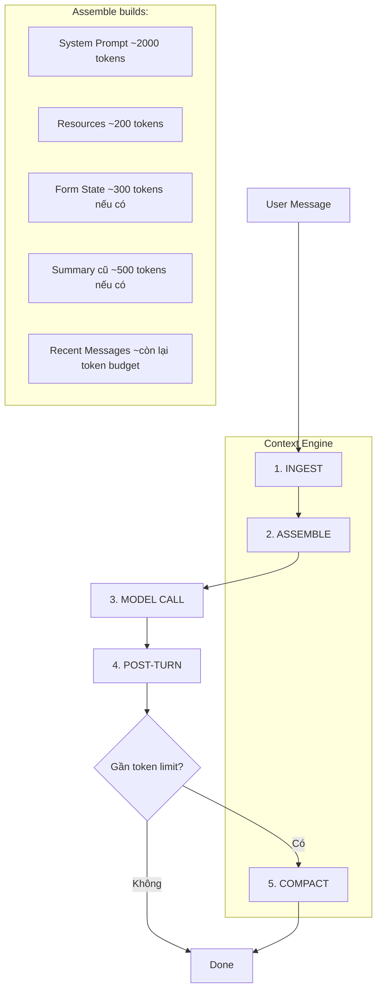
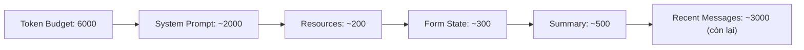
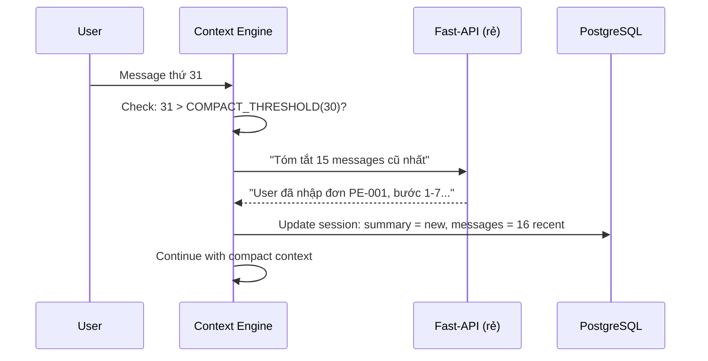

# Context Engine — Kế hoạch triển khai

> Kế thừa pattern từ OpenClaw (openclaw.ai) — context engine quản lý token budget,
> auto-compact, không cắt cứng messages.

## Tổng quan



## Phase 1: Context Engine (tuần 1)

### 1.1 Token Counter

```
Ước lượng tokens: 1 token ≈ 4 chars (tiếng Anh) / 2 chars (tiếng Việt)
Dùng formula đơn giản, không cần tiktoken library.

TOKEN_BUDGET = 8000 (cho Claude CLI, safe margin)
RESERVED_FOR_RESPONSE = 2000

Available = TOKEN_BUDGET - RESERVED_FOR_RESPONSE = 6000 tokens cho context
```

**File:** `src/modules/context/token-counter.ts`
```typescript
export function estimateTokens(text: string): number {
  // Vietnamese text: ~2 chars per token
  // English text: ~4 chars per token
  // Mixed: ~3 chars per token (safe estimate)
  return Math.ceil(text.length / 3);
}
```

### 1.2 Context Assembler

Thay thế `buildOptimizedHistory()` hiện tại.

**Thứ tự ưu tiên (không thay đổi):**
1. System prompt (bot persona, tools, rules) — **luôn giữ**
2. Resources summary (forms, collections, files) — **luôn giữ**
3. Form state (nếu đang điền form) — **luôn giữ**
4. Summary cũ (nếu có) — **giữ nếu đủ budget**
5. Recent messages — **fill còn lại budget**



**File:** `src/modules/context/assembler.ts`
```typescript
interface ContextBlock {
  type: 'system' | 'resources' | 'form' | 'summary' | 'message';
  content: string;
  tokens: number;
  priority: number; // 1=highest (always keep)
}

export function assembleContext(blocks: ContextBlock[], budget: number): {
  systemPrompt: string;
  history: { role: string; content: string }[];
  totalTokens: number;
  truncated: boolean;
}
```

**Logic:**
```
1. Sort blocks by priority (ascending = higher priority first)
2. Add blocks until budget exhausted
3. For messages: add from newest → oldest (keep recent)
4. If messages don't fit: mark truncated = true
5. Return assembled context + token count
```

### 1.3 Auto-Compact (Summarization)

**Trigger:** Khi session messages > COMPACT_THRESHOLD (30 messages)

**Pattern từ OpenClaw:**
- Trước khi compact → "flush durable memories" (lưu gì quan trọng vào memory)
- Summarize older messages → 1 paragraph
- Keep recent messages intact
- Replace old messages with summary



**File:** `src/modules/context/compactor.ts`
```typescript
export async function compactSession(
  sessionId: string,
  summarizer: (text: string) => Promise<string>
): Promise<void>
```

**Rules:**
- Compact threshold: 30 messages
- Keep recent: 15 messages
- Summarize: 15 oldest messages → 1 paragraph
- Summary chain: new summary = old summary + new summary (không mất context lũy kế)
- Summarizer dùng fast-api (x-or.cloud) — rẻ, chỉ cần tóm tắt

## Phase 2: Memory Overhaul (tuần 2)

### 2.1 Bỏ auto-learn rác

**Hiện tại:** Mỗi tool call → auto save knowledge → rác
**Mới:** Chỉ lưu khi user explicit nói "nhớ", "lưu", "ghi nhớ"

```
Bỏ: mergeOrCreateRule() sau mỗi request
Giữ: storeKnowledge() khi user explicit yêu cầu
Giữ: update_instructions() tool — bot tự cập nhật hướng dẫn
```

### 2.2 Memory Search — Vector thay Keyword

**Hiện tại:** keyword matching → score 0.57 cho "nhập đơn hàng" match "kiểm tra đề bài" → SAI

**Mới:** Vector embedding + cosine similarity

```
Option A: Dùng transformers.js (local, free, chậm hơn)
Option B: Dùng fast-api embed endpoint (nếu có)
Option C: BM25 text search (đơn giản, chính xác hơn keyword)
```

**Recommend: Option C (BM25)** — không cần ML model, PostgreSQL full-text search đủ tốt:
```sql
SELECT *, ts_rank(to_tsvector('vietnamese', content), plainto_tsquery('vietnamese', 'nhập đơn hàng')) as rank
FROM knowledge_entries
WHERE tenant_id = $1
ORDER BY rank DESC LIMIT 5;
```

### 2.3 Memory = Instructions (merge)

**Hiện tại:** knowledge_entries + instructions riêng biệt → confuse
**Mới:** Gộp thành 1 — `instructions` trong tenant

```
instructions = tool base (auto-gen) + resources (auto-gen) + user-taught (explicit)

Knowledge entries → chuyển thành instructions text
Không cần bảng knowledge_entries nữa (hoặc chỉ dùng cho search)
```

## Phase 3: Agent Loop Fix (tuần 3)

### 3.1 Timeout-based thay Turns-based

**Hiện tại:** `--max-turns 15` → cứng, tool chain dài bị cắt
**Mới:** Timeout 120s, không giới hạn turns

```
CLI: claude --print --max-turns 50 --timeout 120000
→ Chạy đến khi xong hoặc 120s timeout
→ Không bị cắt giữa tool chain
```

### 3.2 Tool Fail Handling

**Hiện tại:** Tool fail → bot bịa response
**Mới:** Tool fail → retry 1 lần → nếu fail → báo rõ user

```typescript
executeTool: async (tool, args) => {
  try {
    return await registry.execute(tool, args, tenantId, ctx);
  } catch (e) {
    // Retry once
    try { return await registry.execute(tool, args, tenantId, ctx); }
    catch (e2) {
      return { error: `Tool ${tool} failed: ${e2.message}. Hãy báo user lỗi cụ thể, KHÔNG bịa kết quả.` };
    }
  }
}
```

### 3.3 Tool Result Sanitization

**Pattern từ OpenClaw:** Sanitize tool results trước khi inject vào context
```
- Truncate results > 2000 chars
- Remove sensitive data (passwords, tokens)
- Format cho LLM dễ đọc
```

## Timeline

```
Tuần 1: Context Engine (token counter + assembler + compactor)
  → Fix: không cắt cứng 20 messages
  → Fix: summary chạy đúng
  → Fix: token budget aware

Tuần 2: Memory (bỏ auto-learn + BM25 search)
  → Fix: không learn rác
  → Fix: search chính xác
  → Fix: instructions auto-gen

Tuần 3: Agent Loop (timeout + tool fail)
  → Fix: tool chain không bị cắt
  → Fix: tool fail không bịa
  → Fix: sanitize results
```

## Files cần tạo/sửa

```
Tạo mới:
  src/modules/context/token-counter.ts    — ước lượng tokens
  src/modules/context/assembler.ts        — assemble context fit budget
  src/modules/context/compactor.ts        — auto-summarize old messages

Sửa:
  src/bot/middleware/03-context.ts         — dùng assembler mới
  src/bot/middleware/05-execute.ts         — timeout-based, tool fail handling
  src/bot/middleware/06-learn.ts           — bỏ auto-learn, chỉ explicit save
  src/modules/conversations/conversation.service.ts — dùng compactor mới
  src/bot/telegram.bot.ts                 — dùng assembler thay buildOptimizedHistory
```
