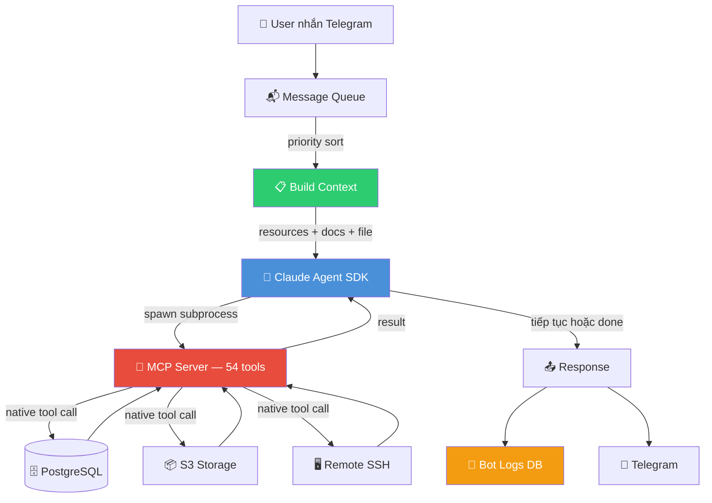
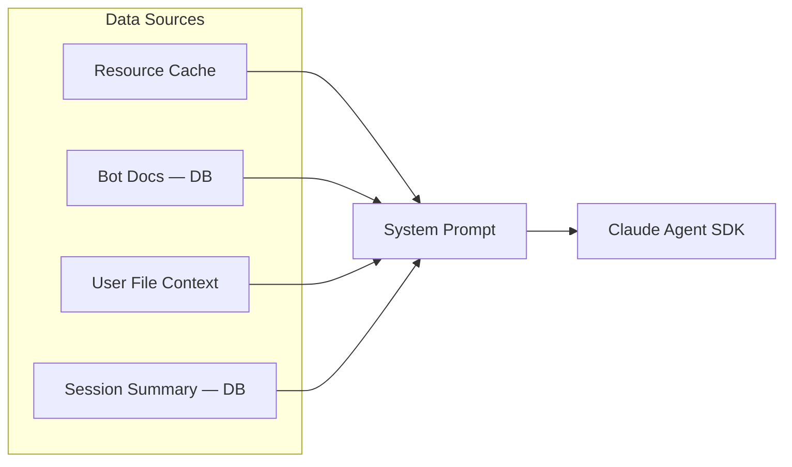
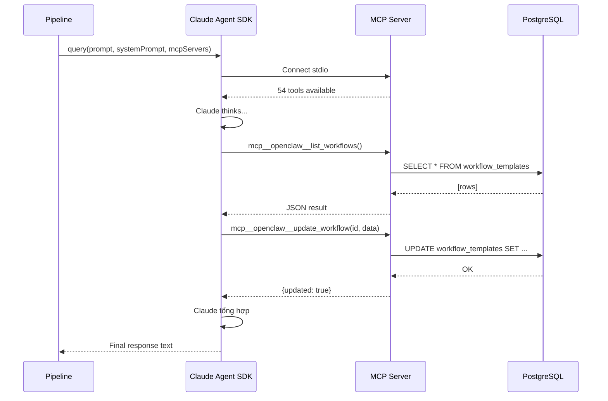
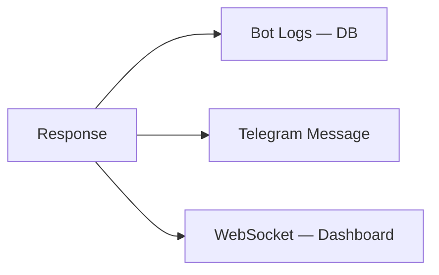
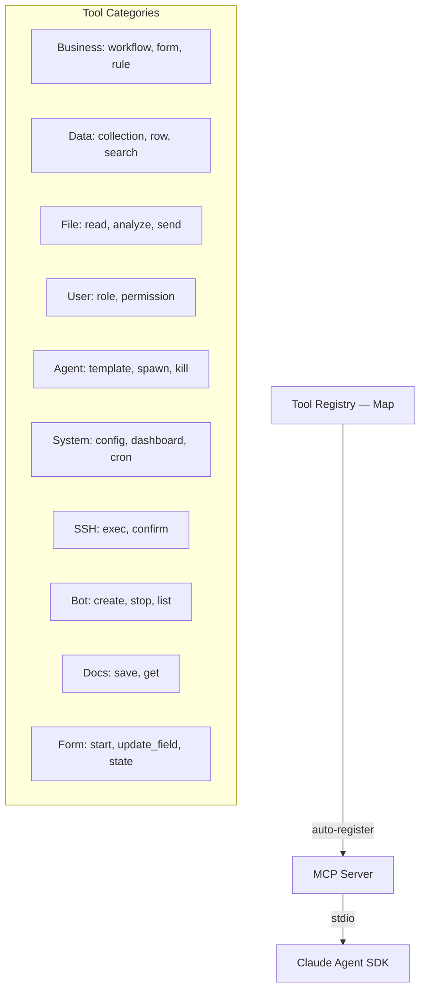
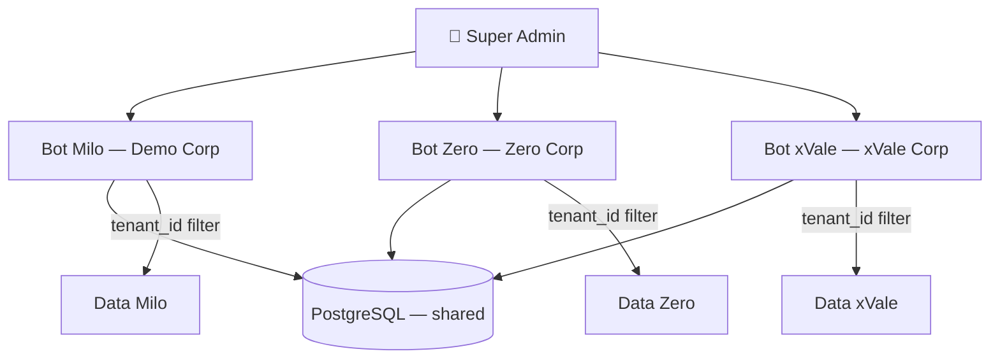

# Pipeline Architecture

## Tổng quan

OpenClaw dùng **Claude Agent SDK + MCP** cho native tool calling. Không parse text, không hardcode tools.

```
User nhắn Telegram
  → Queue (priority sort)
  → Build context (resources + docs + file context)
  → Claude Agent SDK query()
    → SDK spawn MCP subprocess
    → MCP expose 54 tools native
    → Claude gọi tools trực tiếp (không parse text)
    → Tools execute → kết quả trả về Claude
    → Claude tiếp tục hoặc trả response
  → Log (DB persistent)
  → Response → Telegram
```

## Flow chi tiết



## 3 Steps

### Step 1: Build Context



| Source | Mô tả | Lưu ở |
|--------|--------|-------|
| **Resource Cache** | Forms, collections, files count | Memory (rebuild khi data đổi) |
| **Bot Docs** | Kiến thức bot học — inject thẳng | PostgreSQL `bot_docs` |
| **File Context** | File user vừa upload — auto-analyzed | Memory (30 min TTL) |
| **Session Summary** | Tóm tắt conversation cũ | PostgreSQL `conversation_sessions` |

### Step 2: SDK + MCP Execute



**Native tool calling** — SDK gọi tools qua MCP protocol, không parse text `tool_calls` block.

### Step 3: Log + Response



| Log type | Mô tả |
|----------|--------|
| `user_message` | User nói gì |
| `bot_response` | Bot trả lời gì + thời gian + engine |
| `tool_call` | Tool nào được gọi + args + result |

## Tool System

### MCP Server (54 tools)



Tools tự động register từ `tool-registry.ts` → MCP expose tất cả. Thêm tool mới = `registerTool("name", handler)` → MCP tự thấy.

### Tool naming trong SDK

```
MCP tool name: mcp__openclaw__list_workflows
                ↑         ↑           ↑
              prefix   server name  tool name
```

SDK gọi: `mcp__openclaw__list_workflows` → MCP route → `executeTool("list_workflows")` → DB query → result.

## Multi-Bot Architecture



- 1 process, N bots (multi-tenant)
- Data tách biệt per `tenant_id`
- Mỗi bot có: ai_config, bot_docs, users, collections, files riêng
- Super Admin quản lý tất cả bots

## Memory / Context

```
SDK Sessions (tạm thời — trong memory):
  → Context window management
  → Conversation flow liên tục

PostgreSQL (vĩnh viễn):
  → bot_docs — kiến thức bot (inject vào prompt)
  → conversation_sessions — summary + messages
  → bot_logs — log mọi thứ
  → collections, files, forms... — data thật

User File Context (tạm thời — 30 min):
  → File user vừa upload → auto-analyze → inject vào prompt
  → User hỏi tiếp → bot có data sẵn
```

## So sánh với frameworks khác

| Tiêu chí | LangChain | CrewAI | OpenAI Assistants | OpenClaw |
|----------|-----------|--------|-------------------|----------|
| Pipeline | Chain-based | Task-based | Thread-based | **SDK + MCP** |
| Tool discovery | Static | Static | Static schema | **MCP auto-discover** |
| Tool execution | Custom loop | Agent calls | API handles | **MCP native** |
| Multi-agent | RouterChain | Hierarchical | Single | **Multi-bot + Personas** |
| Memory | Buffer/Summary | 3-tier | Thread auto | **DB docs + SDK session** |
| Config | Code | Code/YAML | API | **100% DB** |
| Multi-tenant | No | No | No | **Yes — N bots, 1 process** |

## File Structure

```
src/
├── bot/
│   ├── pipeline.ts           — 3 steps: context → SDK → log
│   ├── prompt-builder.ts     — system prompt from DB config
│   ├── tool-registry.ts      — Map<string, handler> — 54 tools
│   ├── telegram.bot.ts       — multi-bot polling + file upload
│   └── middleware/
│       └── logger.ts         — structured pipeline logs
├── mcp/
│   ├── server.ts             — MCP server (auto from registry)
│   └── stdio-server.ts       — entry point cho SDK subprocess
├── modules/
│   ├── context/
│   │   ├── token-counter.ts  — estimate tokens
│   │   ├── compactor.ts      — auto-summarize old messages
│   │   ├── embedding.ts      — vector embeddings (transformers.js)
│   │   └── user-file-context.ts — recent file per user
│   ├── cache/
│   │   └── resource-cache.ts — forms/collections/files count per tenant
│   ├── logs/
│   │   └── bot-logger.ts     — persistent logs to DB
│   └── ...services
├── api/
│   └── dashboard.ts          — Express API + WebSocket logs + static web
└── index.ts                  — startup: DB → agents → MCP → bots → API
```
